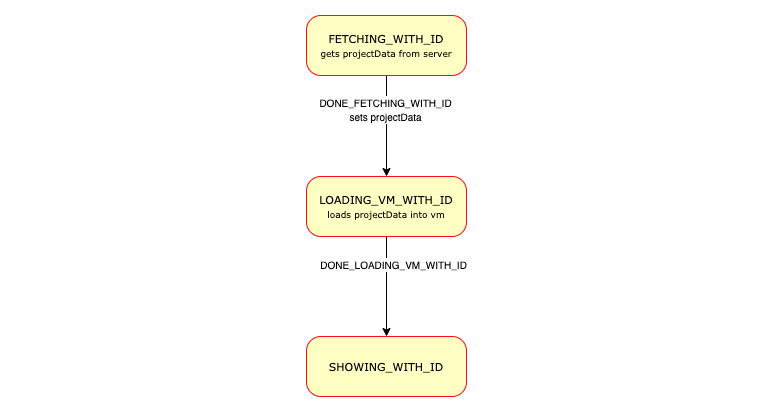

# E羊icques&mdash;An unofficial Scratch mod

The mod is available at https://sheeptester.github.io/scratch-gui/.

## URL parameters

The URLs in URL parameters should be [URI encoded](https://developer.mozilla.org/en-US/docs/Web/JavaScript/Reference/Global_Objects/encodeURIComponent).

| URL parameter | Description |
| ------------- | ----------- |
| `extension=[URL]` or `url=[URL]` | Load an extension dynamically (more info on making an extension [here](https://scratch.mit.edu/discuss/topic/277217/)). |
| `width=[NUMBER]` | Custom stage width (default 480). |
| `height=[NUMBER]` | Custom stage width (default 360). |
| `username=[STRING]` | Set a custom username (default "username") |
| `cloud_host=[URL]` | Use a custom cloud host instead of the default behaviour, which is to save cloud variables to localStorage. Note that for some reason, Scratch doesn't want you to include the protocol (ie, omit `ws://` or `wss://`). |
| `compatibility_mode=false` | Disables compatibility mode, which forces projects to run at 30 fps. |
| `limits=false` | Removes many limits, such as for clones and lists. Note that a few limits, like the number of cloud variables, are removed by default in this mod. |

In addition, you can finish the URL with a hash followed by a project ID to load a project from the Scratch website or a URI encoded URL to a project file.

For example, https://sheeptester.github.io/scratch-gui/?url=https://sheeptester.github.io/javascripts/utilities.js&width=640&height=360 will load my [Utilities extension](https://scratch.mit.edu/discuss/topic/306317/) and use a 16:9 stage size.

## Development

gui (you're here) &middot; [vm](https://github.com/SheepTester/scratch-vm/) &middot; [paint](https://github.com/SheepTester/scratch-paint/) &middot; [svg-renderer](https://github.com/SheepTester/scratch-svg-renderer/)

It's called E羊icques for two reasons:

- To see how people deal with radical names like these

- To comply with the Scratch license, which forbids the usage of their name to promote derived products like this mod (because it might seem like the mod is official when it's not)

I also made the backpack sync to localStorage instead of being completely useless (because we can't access Scratch's backpack servers outside of Scratch).

Here's how I made the mod:

- Load an extension from the URL: [gui](https://github.com/SheepTester/scratch-gui/commit/b4024c6e6c2fc8202d6301920b9a2fce54ff079e), [vm](https://github.com/SheepTester/scratch-vm/commit/06765ebebdcf9eba6ab1ededf9b2c91a55bcc016)

- 16:9 (640 by 360): [gui 1](https://github.com/SheepTester/scratch-gui/commit/2bf3d72600e53aa1a0463d3c17043ea3c384a02b), [gui 2](https://github.com/SheepTester/scratch-gui/commit/bf67203e58bfb2a11b89f6e3e4c09b80d339390e), [vm](https://github.com/SheepTester/scratch-vm/commit/429201f1c9eca248f5248b9ff3ac2a74da1c0366), [paint 1](https://github.com/SheepTester/scratch-paint/commit/70e4d4c13e993fe1cd21878fa9633cebb68de511), [paint 2](https://github.com/SheepTester/scratch-paint/commit/0debd0feaaf907107a3403025da38c52fb231ad6) (There was an issue with loading costumes that wasn't fixed until the next step...)

- Support all stage sizes: [gui](https://github.com/SheepTester/scratch-gui/commit/752afdc8108ef15eb1c7094397b8a65c7376f91d), [vm](https://github.com/SheepTester/scratch-vm/commit/bc253cf3d006695d6713cee40af191cc09b47a0e), [paint 1](https://github.com/SheepTester/scratch-paint/commit/59c8d78aad50e03f85572c4369867ac8b4c07fb9), [paint 2](https://github.com/SheepTester/scratch-paint/commit/1a036a098d8c86b4c0ae39b13fd8187c470c0123), [svg-renderer](https://github.com/SheepTester/scratch-svg-renderer/commit/e39ae12301911c48672289fb27a143ed8fdafed1)

- Detect modifier keys [vm](https://github.com/SheepTester/scratch-vm/commit/7d7993a6acd0c3a5d6062311f50069cb8b9ae74f)

---

#### Scratch GUI is a set of React components that comprise the interface for creating and running Scratch 3.0 projects

[](https://travis-ci.com/LLK/scratch-gui)
[](https://greenkeeper.io/)

## Installation
This requires you to have Git and Node.js installed.

In your own node environment/application:
```bash
npm install https://github.com/LLK/scratch-gui.git
```
If you want to edit/play yourself:
```bash
git clone https://github.com/LLK/scratch-gui.git
cd scratch-gui
npm install
```

**You may want to add `--depth=1` to the `git clone` command because there are some [large files in the git repository history](https://github.com/LLK/scratch-gui/issues/5140).**

## Getting started
Running the project requires Node.js to be installed.

## Running
Open a Command Prompt or Terminal in the repository and run:
```bash
npm start
```
Then go to [http://localhost:8601/](http://localhost:8601/) - the playground outputs the default GUI component

## Developing alongside other Scratch repositories

### Getting another repo to point to this code


If you wish to develop `scratch-gui` alongside other scratch repositories that depend on it, you may wish
to have the other repositories use your local `scratch-gui` build instead of fetching the current production
version of the scratch-gui that is found by default using `npm install`.

Here's how to link your local `scratch-gui` code to another project's `node_modules/scratch-gui`.

#### Configuration

1. In your local `scratch-gui` repository's top level:
    1. Make sure you have run `npm install`
    2. Build the `dist` directory by running `BUILD_MODE=dist npm run build`
    3. Establish a link to this repository by running `npm link`

2. From the top level of each repository (such as `scratch-www`) that depends on `scratch-gui`:
    1. Make sure you have run `npm install`
    2. Run `npm link scratch-gui`
    3. Build or run the repositoriy

#### Using `npm run watch`

Instead of `BUILD_MODE=dist npm run build`, you can use `BUILD_MODE=dist npm run watch` instead. This will watch for changes to your `scratch-gui` code, and automatically rebuild when there are changes. Sometimes this has been unreliable; if you are having problems, try going back to `BUILD_MODE=dist npm run build` until you resolve them.

#### Oh no! It didn't work!

If you can't get linking to work right, try:
* Follow the recipe above step by step and don't change the order. It is especially important to run `npm install` _before_ `npm link`, because installing after the linking will reset the linking.
* Make sure the repositories are siblings on your machine's file tree, like `.../.../MY_SCRATCH_DEV_DIRECTORY/scratch-gui/` and `.../.../MY_SCRATCH_DEV_DIRECTORY/scratch-www/`.
* Consistent node.js version: If you have multiple Terminal tabs or windows open for the different Scratch repositories, make sure to use the same node version in all of them.
* If nothing else works, unlink the repositories by running `npm unlink` in both, and start over.

## Testing
### Documentation

You may want to review the documentation for [Jest](https://facebook.github.io/jest/docs/en/api.html) and [Enzyme](http://airbnb.io/enzyme/docs/api/) as you write your tests.

See [jest cli docs](https://facebook.github.io/jest/docs/en/cli.html#content) for more options.

### Running tests

*NOTE: If you're a windows user, please run these scripts in Windows `cmd.exe`  instead of Git Bash/MINGW64.*

Before running any tests, make sure you have run `npm install` from this (scratch-gui) repository's top level.

#### Main testing command

To run linter, unit tests, build, and integration tests, all at once:
```bash
npm test
```

#### Running unit tests

To run unit tests in isolation:
```bash
npm run test:unit
```

To run unit tests in watch mode (watches for code changes and continuously runs tests):
```bash
npm run test:unit -- --watch
```

You can run a single file of integration tests (in this example, the `button` tests):

```bash
$(npm bin)/jest --runInBand test/unit/components/button.test.jsx
```

#### Running integration tests

Integration tests use a headless browser to manipulate the actual html and javascript that the repo
produces. You will not see this activity (though you can hear it when sounds are played!).

Note that integration tests require you to first create a build that can be loaded in a browser:

```bash
npm run build
```

Then, you can run all integration tests:

```bash
npm run test:integration
```

Or, you can run a single file of integration tests (in this example, the `backpack` tests):

```bash
$(npm bin)/jest --runInBand test/integration/backpack.test.js
```

If you want to watch the browser as it runs the test, rather than running headless, use:

```bash
USE_HEADLESS=no $(npm bin)/jest --runInBand test/integration/backpack.test.js
```

## Troubleshooting

### Ignoring optional dependencies

When running `npm install`, you can get warnings about optionsl dependencies:

```
npm WARN optional Skipping failed optional dependency /chokidar/fsevents:
npm WARN notsup Not compatible with your operating system or architecture: fsevents@1.2.7
```

You can suppress them by adding the `no-optional` switch:

```
npm install --no-optional
```

Further reading: [Stack Overflow](https://stackoverflow.com/questions/36725181/not-compatible-with-your-operating-system-or-architecture-fsevents1-0-11)

### Resolving dependencies

When installing for the first time, you can get warnings which need to be resolved:

```
npm WARN eslint-config-scratch@5.0.0 requires a peer of babel-eslint@^8.0.1 but none was installed.
npm WARN eslint-config-scratch@5.0.0 requires a peer of eslint@^4.0 but none was installed.
npm WARN scratch-paint@0.2.0-prerelease.20190318170811 requires a peer of react-intl-redux@^0.7 but none was installed.
npm WARN scratch-paint@0.2.0-prerelease.20190318170811 requires a peer of react-responsive@^4 but none was installed.
```

You can check which versions are available:

```
npm view react-intl-redux@0.* version
```

You will neet do install the required version:

```
npm install  --no-optional --save-dev react-intl-redux@^0.7
```

The dependency itself might have more missing dependencies, which will show up like this:

```
user@machine:~/sources/scratch/scratch-gui (491-translatable-library-objects)$ npm install  --no-optional --save-dev react-intl-redux@^0.7
scratch-gui@0.1.0 /media/cuideigin/Linux/sources/scratch/scratch-gui
├── react-intl-redux@0.7.0
└── UNMET PEER DEPENDENCY react-responsive@5.0.0
```

You will need to install those as well:

```
npm install  --no-optional --save-dev react-responsive@^5.0.0
```

Further reading: [Stack Overflow](https://stackoverflow.com/questions/46602286/npm-requires-a-peer-of-but-all-peers-are-in-package-json-and-node-modules)


## Publishing to GitHub Pages
You can publish the GUI to github.io so that others on the Internet can view it.
[Read the wiki for a step-by-step guide.](https://github.com/LLK/scratch-gui/wiki/Publishing-to-GitHub-Pages)

## Understanding the project state machine

Since so much code throughout scratch-gui depends on the state of the project, which goes through many different phases of loading, displaying and saving, we created a "finite state machine" to make it clear which state it is in at any moment. This is contained in the file src/reducers/project-state.js .

It can be hard to understand the code in src/reducers/project-state.js . There are several types of data and functions used, which relate to each other:

### Loading states

These include state constant strings like:

* `NOT_LOADED` (the default state),
* `ERROR`,
* `FETCHING_WITH_ID`,
* `LOADING_VM_WITH_ID`,
* `REMIXING`,
* `SHOWING_WITH_ID`,
* `SHOWING_WITHOUT_ID`,
* etc.

### Transitions

These are names for the action which causes a state change. Some examples are:

* `START_FETCHING_NEW`,
* `DONE_FETCHING_WITH_ID`,
* `DONE_LOADING_VM_WITH_ID`,
* `SET_PROJECT_ID`,
* `START_AUTO_UPDATING`,

### How transitions relate to loading states

As this diagram of the project state machine shows, various transition actions can move us from one loading state to another:


_Note: for clarity, the diagram above excludes states and transitions relating to error handling._

#### Example

Here's an example of how states transition.

Suppose a user clicks on a project, and the page starts to load with url https://scratch.mit.edu/projects/123456 .

Here's what will happen in the project state machine:



1. When the app first mounts, the project state is `NOT_LOADED`.
2. The `SET_PROJECT_ID` redux action is dispatched (from src/lib/project-fetcher-hoc.jsx), with `projectId` set to `123456`. This transitions the state from `NOT_LOADED` to `FETCHING_WITH_ID`.
3. The `FETCHING_WITH_ID` state. In src/lib/project-fetcher-hoc.jsx, the `projectId` value `123456` is used to request the data for that project from the server.
4. When the server responds with the data, src/lib/project-fetcher-hoc.jsx dispatches the `DONE_FETCHING_WITH_ID` action, with `projectData` set. This transitions the state from `FETCHING_WITH_ID` to `LOADING_VM_WITH_ID`.
5. The `LOADING_VM_WITH_ID` state. In src/lib/vm-manager-hoc.jsx, we load the `projectData` into Scratch's virtual machine ("the vm").
6. When loading is done, src/lib/vm-manager-hoc.jsx dispatches the `DONE_LOADING_VM_WITH_ID` action. This transitions the state from `LOADING_VM_WITH_ID` to `SHOWING_WITH_ID`
7. The `SHOWING_WITH_ID` state. Now the project appears normally and is playable and editable.

## Donate
We provide [Scratch](https://scratch.mit.edu) free of charge, and want to keep it that way! Please consider making a [donation](https://secure.donationpay.org/scratchfoundation/) to support our continued engineering, design, community, and resource development efforts. Donations of any size are appreciated. Thank you!
